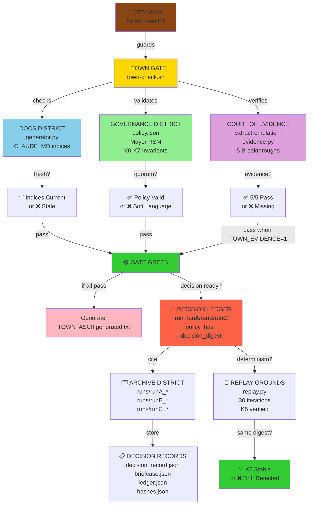
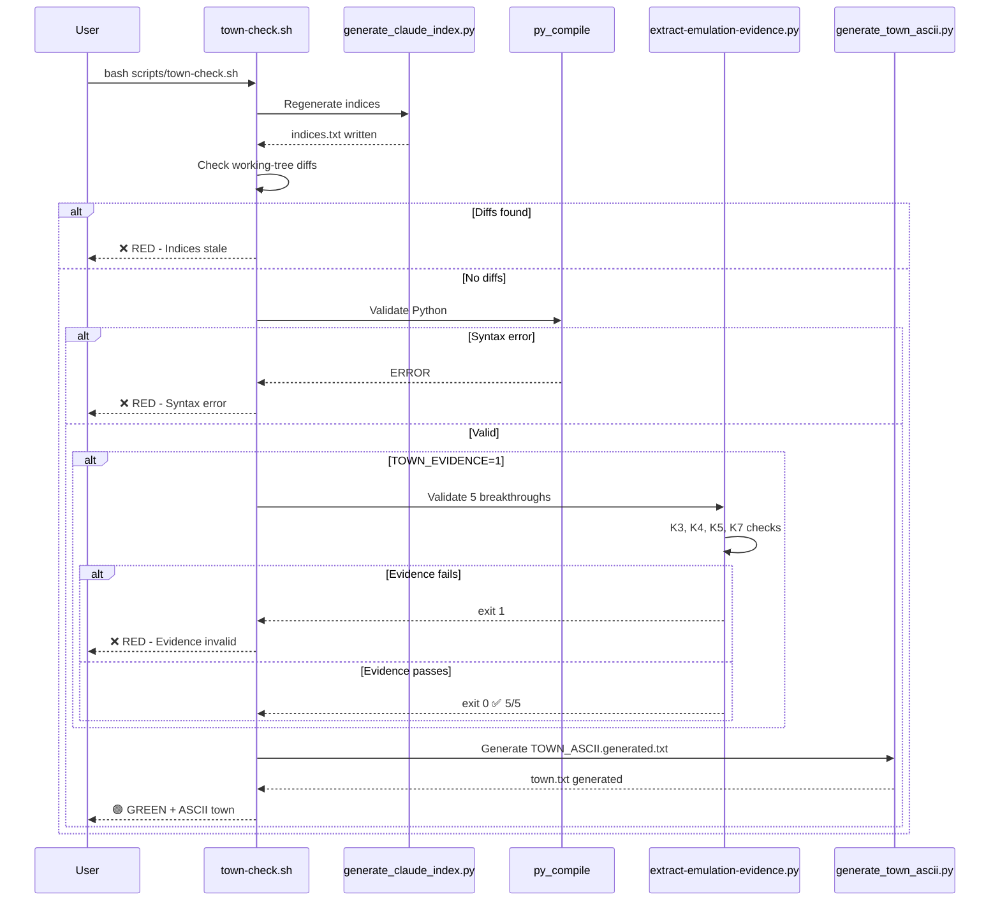
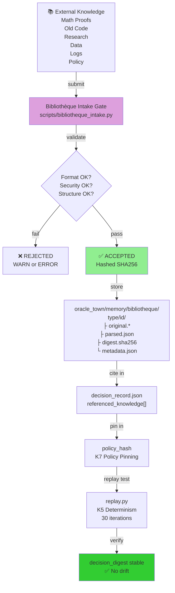
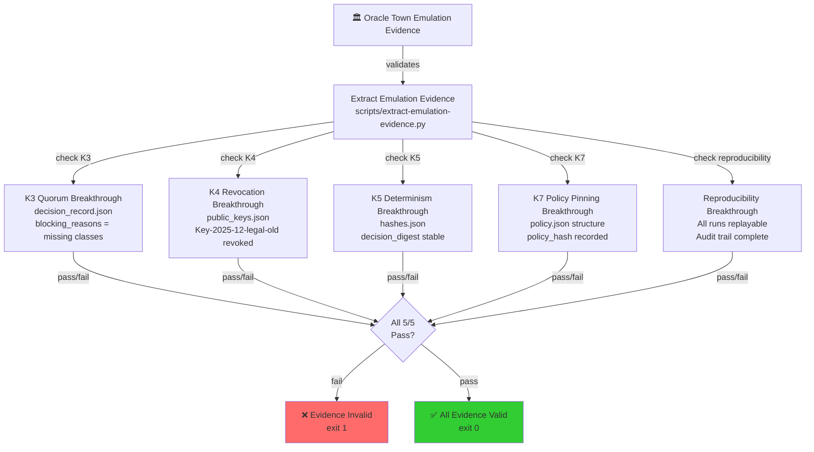
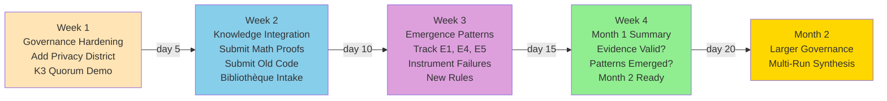

# Oracle Town Map (Mermaid)

## Town Structure (System Dependencies)

## Daily Workflow

```mermaid
graph LR
    Start["👤 You"] -->|submit claim| Claim["Claim"]
    Claim -->|validate schema| Intake["Intake Guard"]
    Intake -->|parse obligations| Compiler["Claim Compiler"]
    Compiler -->|analyze| Districts["4 Districts<br/>Legal / Tech<br/>Business / Social"]
    Districts -->|score| TownHall["Town Hall<br/>QI-INT v2"]
    TownHall -->|check invariants| Mayor["Mayor RSM<br/>Pure Function"]
    Mayor -->|K0-K7 verification| Decision{"Decision"}
    Decision -->|NO_SHIP| NoShip["❌ NO_SHIP<br/>blocking_reasons"]
    Decision -->|SHIP| Ship["✅ SHIP<br/>receipts signed"]
    NoShip -->|record| Ledger["📜 Append-Only Ledger<br/>decision_record.json<br/>policy_hash pinned"]
    Ship -->|record| Ledger
    Ledger -->|hash| Digest["decision_digest<br/>K5 Stable"]

    style Intake fill:#FFE4B5
    style Mayor fill:#90EE90
    style NoShip fill:#FF6B6B
    style Ship fill:#90EE90
    style Ledger fill:#FF6347
    style Digest fill:#32CD32
```

## Gate Execution (town-check.sh)

## Knowledge Base (Bibliothèque) Integration

## Evidence System (Machine-Validated)

## Month 1 Iteration Plan

## Reading Navigation

| Goal | Start Here |
|------|-----------|
| **Quick start (5 min)** | QUICK_START_AUTONOMOUS.md |
| **System overview (10 min)** | AUTONOMOUS_MODE_ACTIVATED.md |
| **Full verification** | SYSTEM_READINESS_CHECKLIST.md |
| **Evidence explained** | ORACLE_TOWN_EMULATION_EVIDENCE.md |
| **Month 1 walkthrough** | SCENARIO_NEW_DISTRICT.md |
| **Knowledge base protocol** | oracle_town/memory/BIBLIOTHEQUE_INTAKE.md |
| **Town visual** | TOWN_ASCII.generated.txt (auto-generated) |
| **This session** | SESSION_SUMMARY.md |

## Town Metaphor Explained

- **CITY WALL (K1)** — Fail-closed boundary; no entry without proof
- **TOWN GATE (town-check.sh)** — Guards entrance; verifies indices, syntax, optionally evidence
- **DOCS DISTRICT** — CLAUDE.md, indices, documentation freshness
- **GOVERNANCE DISTRICT** — Policy, Mayor RSM, K0-K7 invariants, quorum rules
- **COURT OF EVIDENCE** — Evidence validators, breakthrough checks, no silent drift
- **DECISION LEDGER** — All decisions recorded, hashed, immutable
- **ARCHIVE DISTRICT** — Historical runs (runA, runB, runC), patterns
- **REPLAY GROUNDS** — Determinism verification, K5 testing, digest stability
- **BIBLIOTHÈQUE** — Knowledge base, external knowledge integration, hashing

All connected through the **gate** which runs automatically and generates the **ASCII town visualization** showing current state.

