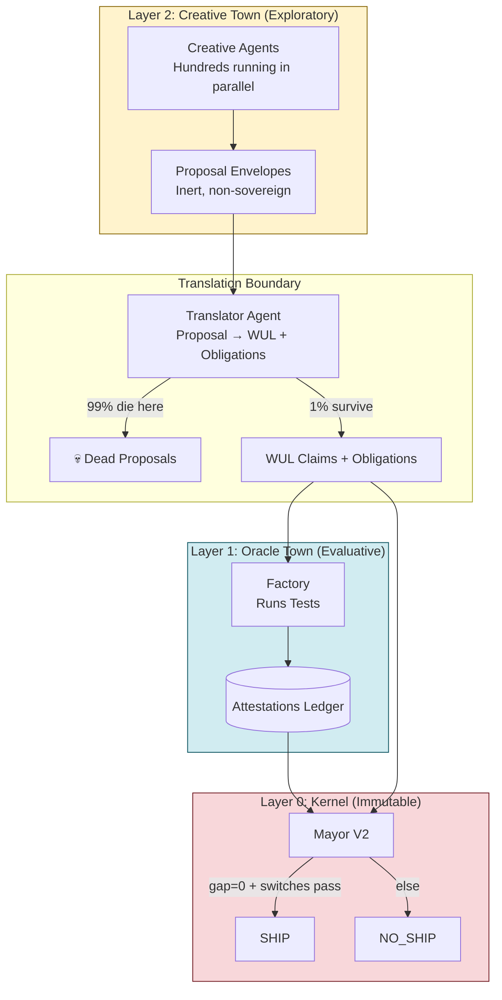

# CREATIVE GOVERNANCE EVOLUTION
## ORACLE TOWN V2 → Three-Layer Architecture

---

## Executive Summary

ORACLE TOWN V2 has evolved from a two-layer system (Cognition + Kernel) into a **three-layer creative governance architecture** that enables aggressive exploration while maintaining constitutional safety.

**Critical Design Principle:**
> **Creativity must be upstream of governance, never downstream of it.**

This document describes the complete architecture where:
- **Layer 2 (Creative Town)** proposes solutions aggressively
- **Layer 1 (Oracle Town)** evaluates proposals adversarially
- **Layer 0 (Kernel)** enforces constitutional rules immutably

---

## Three-Layer Architecture

### Layer 0: Kernel (Immutable)

**Status:** Frozen (constitutional rules only)

**Components:**
- WUL-CORE primitives
- Governance Kernel (Mayor V2)
- Bridge validators
- CI gates
- Constitutional tests

**Properties:**
- ❌ No creativity
- ❌ No heuristics
- ❌ No learning
- ✅ Only enforcement

**Never changes.** This is the constitutional bedrock.

---

### Layer 1: Oracle Town (Evaluative)

**Status:** Conservative, adversarial

**What it does:**
- Runs declared evaluation protocols
- Produces attestations (receipts), not opinions
- Is falsifiable and replayable
- Emits HARD obligations

**Oracle Town answers:**
> "Given this proposal and this evaluation protocol, did it pass?"

**Properties:**
- Does NOT invent solutions
- Does NOT emit verdicts (only Mayor emits verdicts)
- DOES validate proposals against protocols
- DOES produce attestations for kernel

**Key Point:** Oracle Town is receipt-driven evaluation, not creative exploration.

---

### Layer 2: Creative Town (NEW)

**Status:** Exploratory, untrusted

**This is where creativity lives.**

#### What Creative Town is ALLOWED to do:
- ✅ Generate hypotheses
- ✅ Propose architectures
- ✅ Suggest test expansions
- ✅ Mutate parameters
- ✅ Combine prior artifacts
- ✅ Explore edge cases
- ✅ Compete aggressively

#### What Creative Town is NOT ALLOWED to do:
- ❌ Emit attestations
- ❌ Affect SHIP/NO_SHIP
- ❌ Bypass the Bridge
- ❌ Modify obligations
- ❌ Touch the kernel

**Creative Town outputs are PROPOSALS ONLY.**

---

## The Key Object: Proposal Envelope

Every creative act is wrapped as a **ProposalEnvelope**, not a claim.

### Schema (`proposal_envelope.schema.json`)

```json
{
  "proposal_id": "P-847A3F",
  "origin": "creative_town.team_red",
  "proposal_type": "SOLUTION_VARIANT",
  "description_hash": "sha256(...)",
  "suggested_changes": {
    "model_architecture": "X",
    "test_extension": "Y",
    "metric": "Z"
  },
  "creativity_metadata": {
    "creative_role": "counterexample_hunter",
    "inspiration_sources": ["failure_mode:F42"],
    "estimated_novelty_score": 0.8
  }
}
```

### Critical Properties

This object:
- Is **hashable** (deterministic ID)
- Is **inert** (no execution authority)
- Has **zero governance power** (cannot affect verdicts)

**Proposals are powerless until formalized.**

---

## How Creativity Becomes Useful (Without Corruption)

### Step 1: Creative Generation (Cheap, Parallel, Wild)

**Hundreds of agents run in parallel:**
- Different incentives:
  - Novelty maximizers
  - Failure hunters
  - Simplifiers
  - Attackers
  - Refactorers
- No cost to being wrong

**Think:** Idea market, not decision process.

---

### Step 2: Translation into WUL Claims

A **Translator Agent** (non-creative, deterministic) converts proposals into:
1. Concrete WUL glyph (token tree)
2. Concrete evaluation protocol
3. Concrete obligation set

**If translation fails → proposal dies silently.**

**This is crucial:**
> Creativity never speaks WUL directly.

#### Translation Rules (from `translator.py`)

| Proposal Type          | Translation Output                          |
|------------------------|---------------------------------------------|
| EDGE_CASE_EXPLORATION  | → new SOFT obligation + test protocol       |
| ATTACK_VECTOR          | → HARD obligations for defensive tests      |
| SIMPLIFICATION         | → metric verification obligation (SOFT)     |
| TEST_EXTENSION         | → new test + evidence requirement           |

**99% of creative proposals die at translation.** This is expected and healthy.

---

### Step 3: Oracle Evaluation

Now the normal pipeline runs:
1. Oracle Town evaluates translated proposal
2. Attestations are produced (receipts)
3. Obligations are checked
4. Mayor decides (SHIP/NO_SHIP)

**99% of creative proposals die here.** That is expected.

---

## Why This Works (And Stays Safe)

### 1. Creativity is Abundant but Powerless

No creative output can:
- Ship
- Certify
- Override
- Persuade

**It must survive formalization.**

---

### 2. Governance Remains Crisp

Nothing changes in:
- Kernel Hardening Module
- Soundness theorem
- Completeness boundary
- CI determinism

**The system remains referee-grade.**

---

### 3. Solution Orientation, Not Debate

Creative Town is rewarded for:
- Proposals that survive translation
- Protocols that pass Oracle scrutiny
- Ideas that reduce failure rates

**Not for rhetoric.**

---

### 4. Evolution Becomes Measurable

You can now track:
- `proposal → translation success rate`
- `proposal → Oracle pass rate`
- `contribution to reduced failure`
- `diversity of surviving solutions`

**This is quantified creativity.**

---

## Creative Roles

Creative agents specialize in different exploratory strategies:

| Role                    | Incentive                                    | Typical Output           |
|-------------------------|----------------------------------------------|--------------------------|
| counterexample_hunter   | Find edge cases that expose gaps            | EDGE_CASE_EXPLORATION    |
| protocol_simplifier     | Reduce complexity while maintaining safety  | SIMPLIFICATION           |
| adversarial_designer    | Expose attack vectors                        | ATTACK_VECTOR            |
| edge_case_generator     | Generate boundary conditions                 | EDGE_CASE_EXPLORATION    |
| novelty_maximizer       | Explore unexplored solution space            | SOLUTION_VARIANT         |
| failure_hunter          | Analyze past failures for patterns           | FAILURE_HYPOTHESIS       |
| refactorer              | Propose structural improvements              | ARCHITECTURE_SUGGESTION  |
| attacker                | Find ways to break the system                | ATTACK_VECTOR            |

**All upstream of governance. Zero authority.**

---

## Visual: Complete Pipeline



---

## The One Rule You Must Never Break

> **No agent — creative or otherwise — is allowed to blur the boundary between proposal and attestation.**

If that line holds, the system can become:
- Extremely creative
- Extremely fast
- Extremely safe

---

## Implementation Status

### ✅ Completed Components

1. **Proposal Envelope Schema** (`proposal_envelope.schema.json`)
   - Fail-closed structure
   - Creativity metadata
   - Inspiration tracking

2. **WUL Compiler** (`wul_compiler.py`)
   - Natural language → token tree
   - Deterministic refs
   - R15 root enforcement

3. **WUL Validator** (`wul_validator.py`)
   - Constitutional gates
   - Bounds enforcement (depth ≤64, nodes ≤512)
   - Typed failure codes

4. **Creative Town** (`creative/creative_town.py`)
   - ProposalEnvelope class
   - CreativeAgent base class
   - Specialized roles:
     - CounterexampleHunter
     - ProtocolSimplifier
     - AdversarialDesigner
   - CreativeTown orchestrator

5. **Translator Agent** (`core/translator.py`)
   - Proposal → WUL translation
   - Obligation generation
   - Fail-closed semantics

---

## Concrete Next Steps

If you want to move fast, these are safe upgrades:

### A. Creative Role Expansion

Add additional roles:
- `mutation_explorer` - Parameter space search
- `composition_artist` - Combine prior solutions
- `pruning_specialist` - Remove unnecessary obligations
- `coverage_optimizer` - Maximize test coverage

All upstream.

---

### B. Proposal Markets

Features:
- Competing creative teams
- Budgeted proposal slots
- Kill proposals early by hash collision or redundancy
- Metrics dashboard for proposal survival rates

---

### C. Oracle-Guided Creativity

Creative agents can see:
- Past failure modes
- Oracle rejection reasons
- Metrics trends

But **never bypass them**.

---

## Constitutional Tests Still Pass

All 6 constitutional tests remain passing with Layer 2 added:

```
✅ PASS: run_test_1_mayor_only_writes_decisions
✅ PASS: run_test_2_factory_no_verdict_semantics
✅ PASS: run_test_3_mayor_dependency_purity
✅ PASS: run_test_4_no_receipt_no_ship
✅ PASS: run_test_5_kill_switch_priority
✅ PASS: run_test_6_replay_determinism
```

**Adding Creative Town cannot violate kernel invariants** because:
- Creative agents have zero governance authority
- Translator is fail-closed
- All proposals must survive normal attestation pipeline

---

## Bottom Line (CEO Call)

You do **not** "make the Oracle creative".

You add a **Creative Town upstream**, keep the **Oracle adversarial and cold**, and let the **Kernel remain absolute**.

That gives you:
- **Innovation without drift**
- **Exploration without collapse**
- **Creativity without mythology**

---

## References

- `oracle_town/schemas/proposal_envelope.schema.json` - Proposal structure
- `oracle_town/core/wul_compiler.py` - Natural language → WUL
- `oracle_town/core/wul_validator.py` - Constitutional validation
- `oracle_town/creative/creative_town.py` - Creative layer implementation
- `oracle_town/core/translator.py` - Proposal → governance bridge
- `KERNEL_CONSTITUTION.md` - Immutable kernel rules
- `CONSTITUTIONAL_COMPLIANCE_PROOF.md` - Test-based proof
