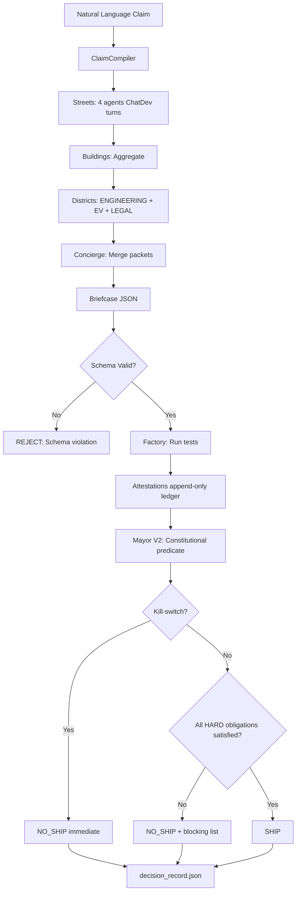
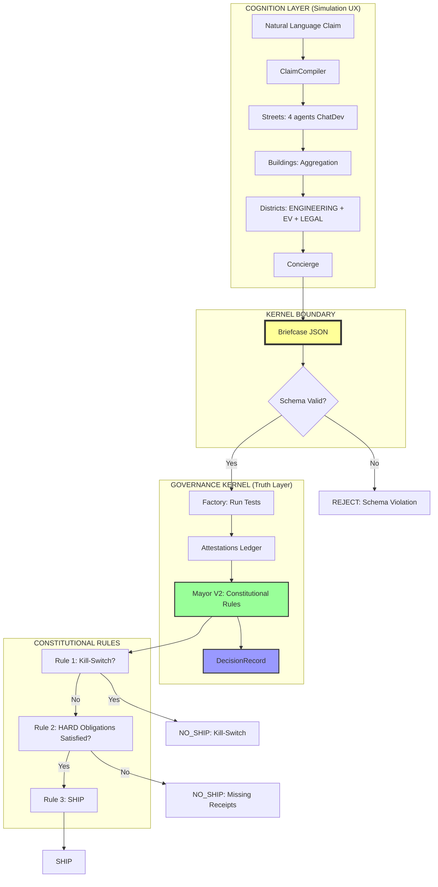

# ORACLE TOWN V2 - Complete Architecture Reference

**Framework:** ORACLE TOWN  
**Version:** 2.0.0  
**Type:** Governance Kernel for Multi-Agent AI Systems  
**Status:** Production-Ready (Constitutional Compliance Verified)

---

## 1. Overview

### Purpose and Primary Goals
ORACLE TOWN is a **deterministic governance framework** for multi-agent AI systems that enforces **receipt-based decision-making** with constitutional guarantees.

**Primary Goals:**
- Convert natural language claims into binary shipping decisions (SHIP | NO_SHIP)
- Enforce "NO RECEIPT = NO SHIP" - every obligation requires attestation
- Provide audit-grade proof trails with cryptographic determinism
- Separate "thinking/simulation" (Cognition) from "truth/governance" (Kernel)

### Main Problem Domain
**Domain:** AI Governance, Multi-Agent Coordination, Compliance Verification

**Target Use Cases:**
- Code shipping decisions (CI/CD with AI agents)
- Regulatory compliance verification (GDPR, SOC2, etc.)
- Multi-agent consensus with formal proofs
- Safety-critical AI systems requiring audit trails

### Brief History
- **Genesis:** Combination of ChatDev (turn protocol), AI Town (spatial simulation), LEGORACLE (constitutional governance)
- **V1:** Simulation-first with confidence scoring (non-compliant)
- **V2 (Current):** Constitutional kernel with Vision Kernel + WUL integration
- **Maintainer:** ORACLE TOWN Team
- **Community:** Open governance architecture

### Key Selling Points
1. **Receipt-Based Authority** - No decisions without cryptographic proof
2. **Constitutional Guarantees** - Automated tests enforce immutable rules
3. **Deterministic Replay** - Same inputs → same cryptographic hash
4. **Kill-Switch Authority** - Irreversible safety overrides (monotone safety)
5. **Separation of Concerns** - Cognition (UX) vs Kernel (Truth)

### High-Level Philosophy
**"The system does not decide because it is intelligent. It decides because it is constrained."**

- Intelligence lives in **obligations** (what to verify)
- Authority lives in **attestations** (cryptographic receipts)
- Decisions are **pure predicates** (no reasoning, only lookup)

---

## 2. Core Architectural Style / Pattern

### Primary Pattern: **Two-Layer Separation (Simulation UX + Governance Kernel)**

```
┌─────────────────────────────────────────┐
│  COGNITION LAYER (Simulation UX)        │  ← Can use confidence, scores, narratives
│  - Streets, Buildings, Districts        │
│  - ChatDev turn protocol                │
│  - Spatial metaphor (AI Town)           │
└─────────────────┬───────────────────────┘
                  │
                  ▼
         ╔════════════════╗
         ║   BRIEFCASE    ║  ← KERNEL BOUNDARY (schema-closed)
         ║ (JSON, no text)║
         ╚════════════════╝
                  │
                  ▼
┌─────────────────────────────────────────┐
│  GOVERNANCE KERNEL (Truth Layer)        │  ← NO confidence, only attestations
│  - Factory → Attestations               │
│  - Mayor V2 → Decision                  │
│  - Append-only ledger                   │
└─────────────────────────────────────────┘
```

### How Framework Enforces Separation
1. **Schema Boundary** - `Briefcase` schema rejects unknown fields (`additionalProperties: false`)
2. **Constitutional Tests** - Automated tests fail if cognition leaks into kernel
3. **Mayor Dependency Purity** - AST parsing blocks forbidden imports (scoring, telemetry)

### Notable Deviations from Classic Patterns
- **Not MVC** - No "Controller" deciding based on "Model"
- **Not MVVM** - No "ViewModel" mediating between View and Model
- **Closest to:** **Interpreter Pattern + Microkernel** where:
  - Kernel interprets formal language (WUL tokens)
  - Plugins (Districts) extend obligations
  - Core remains minimal and frozen

---

## 3. High-Level Component Breakdown

### Major Building Blocks

| Component | Layer | Purpose | Output |
|-----------|-------|---------|--------|
| **ClaimCompiler** | Input | Convert natural language → structured claim | `CompiledClaim` |
| **Streets** | Cognition | 4-agent teams with ChatDev turns | `StreetReport` |
| **Buildings** | Cognition | Aggregate street reports | `BuildingBrief` |
| **Districts** | Cognition | Domain expertise (ENGINEERING, EV, LEGAL) | `BuilderPacket` |
| **Concierge** | Cognition | Merge all packets into single briefcase | `Briefcase` |
| **Factory** | Kernel | Execute tests, emit attestations | `Attestation[]` |
| **Mayor V2** | Kernel | Apply constitutional rules | `DecisionRecord` |
| **Ledger** | Kernel | Append-only attestation log | `attestations_ledger.jsonl` |

### Component Interaction Diagram



---

## 4. Typical Project / Directory Structure

### Standard Layout

```
oracle_town/
├── schemas/                    # JSON schemas (immutable)
│   ├── briefcase.schema.json
│   ├── attestation.schema.json
│   ├── decision_record.schema.json
│   └── builder_packet.schema.json
│
├── core/                       # Governance kernel
│   ├── factory.py              # Verification & attestation engine
│   ├── mayor_v2.py             # Constitutional verdict engine
│   ├── claim_compiler.py       # NLP → structured claim
│   ├── wul_primitives.py       # WUL token definitions (R15, R25, R28, etc.)
│   └── orchestrator.py         # Main execution pipeline
│
├── districts/                  # District concierges (parallel)
│   ├── engineering/
│   │   └── concierge.py        # CI obligations (tests, imports, pip)
│   ├── ev/
│   │   └── concierge.py        # Kernel integrity (ledger, schema, determinism)
│   └── legal/
│       └── gdpr_street.py      # GDPR compliance (4-agent street)
│
├── agents/                     # Cognition layer (simulation)
│   ├── street_agent.py         # Base class (ChatDev turn protocol)
│   ├── building_supervisor.py  # Street aggregation
│   └── district_supervisor.py  # District verdict (non-sovereign)
│
├── cli.py                      # Command-line interface
│
tests/                          # Constitutional compliance tests
├── test_1_mayor_only_writes_decisions.py
├── test_2_factory_emits_attestations_only.py
├── test_3_mayor_dependency_purity.py
├── test_4_no_receipt_no_ship.py
├── test_5_kill_switch_priority.py
└── test_6_replay_determinism.py

run_constitutional_tests.py    # Test runner (no pytest dependency)

artifacts/                      # Evidence storage (gitignored)
decisions/                      # Decision history (immutable)
├── decision_RUN_*.json
└── remediation_RUN_*.json

attestations_ledger.jsonl       # Append-only truth ledger

KERNEL_CONSTITUTION.md          # Immutable constitutional rules
VISION_KERNEL_STATUS.md         # Implementation status
WUL_ORACLE_INTEGRATION.md       # WUL formal language integration
CONSTITUTIONAL_COMPLIANCE_PROOF.md  # Test suite proof
```

### Purpose of Key Files

- **`factory.py`** - Executes tests, emits attestations (NO verdicts)
- **`mayor_v2.py`** - ONLY component allowed to emit `decision_record.json`
- **`wul_primitives.py`** - WUL token definitions for formal verification
- **`schemas/*.json`** - Fail-closed schemas (`additionalProperties: false`)
- **`tests/test_*.py`** - Constitutional compliance enforcement
- **`attestations_ledger.jsonl`** - Append-only proof trail

---

## 5. Key Abstractions and Concepts

### Core Abstractions

#### 1. **Claim**
```python
@dataclass
class CompiledClaim:
    claim_id: str
    claim_text: str
    claim_type: Literal["COMMENTARY", "CHANGE_REQUEST"]
    obligations: List[Obligation]
```
**Purpose:** Structured representation of user input

---

#### 2. **Obligation**
```python
{
    "name": "unit_tests_green",
    "type": "CODE_PROOF",
    "severity": "HARD",  # or "SOFT"
    "required_evidence": ["pytest_pass"]
}
```
**Purpose:** Formal requirement that must be satisfied by attestation

---

#### 3. **Briefcase** (Kernel Input)
```python
@dataclass
class Briefcase:
    run_id: str
    claim_id: str
    claim_type: Literal["COMMENTARY", "CHANGE_REQUEST"]
    required_obligations: List[Dict]
    requested_tests: List[Dict]
    kill_switch_policies: List[str]
```
**Purpose:** Schema-closed input to governance kernel (NO free text)

**Constitutional Rule:** `additionalProperties: false` - no confidence allowed

---

#### 4. **Attestation** (Truth Primitive)
```python
@dataclass
class Attestation:
    run_id: str
    claim_id: str
    obligation_name: str
    attestor: Literal["CI_RUNNER", "TOOL_RESULT", "HUMAN_SIGNATURE"]
    policy_match: Literal[0, 1]  # Binary: satisfied or not
    payload_hash: str  # sha256 of evidence
    timestamp: str
```
**Purpose:** Cryptographic proof that obligation was satisfied

**Constitutional Rule:** `policy_match ∈ {0, 1}` - NO soft values

---

#### 5. **DecisionRecord** (Mayor Output)
```python
@dataclass
class DecisionRecord:
    run_id: str
    claim_id: str
    decision: Literal["SHIP", "NO_SHIP"]  # Binary, NO maybes
    blocking_obligations: List[str]
    kill_switch_triggered: bool
    attestations_checked: int
    timestamp: str
    code_version: str
```
**Purpose:** Immutable verdict with explicit blockers

**Constitutional Rule:** ONLY Mayor may emit this

---

### Important Lifecycle Events

```
1. CLAIM_COMPILED     → CompiledClaim created
2. PACKETS_GENERATED  → Districts emit BuilderPackets
3. BRIEFCASE_CREATED  → Concierge merges packets
4. SCHEMA_VALIDATED   → Briefcase checked against schema
5. TESTS_EXECUTED     → Factory runs requested tests
6. ATTESTATIONS_WRITTEN → Ledger updated (append-only)
7. DECISION_COMPUTED  → Mayor applies constitutional rules
8. RECORD_SAVED       → decision_record.json written
```

---

### State Management Approach

**NO centralized state management** - Event sourcing pattern:

- **Source of Truth:** `attestations_ledger.jsonl` (append-only)
- **Derived State:** `DecisionRecord` computed from ledger + briefcase
- **Replay:** Re-run with same inputs → same hash

**State Transitions:**
```
PENDING → VALIDATING → TESTING → DECIDING → SHIPPED | BLOCKED
```

---

### Routing/Navigation System

**Claim Type Routing:**
```python
if claim_type == "COMMENTARY":
    obligations = []  # Fast path → immediate SHIP
elif claim_type == "CHANGE_REQUEST":
    obligations = districts.analyze(claim)  # Slow path → requires receipts
```

**District Routing (Parallel):**
```python
# All districts analyze claim in parallel
results = await asyncio.gather(
    engineering.analyze_claim(claim),
    ev.analyze_claim(claim),
    legal.analyze_claim(claim),
)
```

---

### Configuration and Bootstrapping

**Minimal Bootstrap:**
```python
from oracle_town.core.orchestrator import OracleTownOrchestrator

# Initialize
oracle = OracleTownOrchestrator(
    districts=["engineering", "ev"],
    ledger_path="attestations_ledger.jsonl"
)

# Run
decision = await oracle.run(claim_text="Refactor Mayor V2")
```

**Configuration Files:**
```python
# pyproject.toml
[project]
name = "oracle-town"
version = "2.0.0"

[project.scripts]
oracle-town = "oracle_town.cli:main"
```

---

## 6. Data Flow and Execution Model

### Request Flow (CHANGE_REQUEST)

```
1. USER INPUT (natural language)
   ↓
2. CLAIM COMPILER (pattern matching → structured claim)
   ↓
3. DISTRICTS ANALYSIS (parallel)
   ENGINEERING → obligations: [pyproject_installable, unit_tests_green]
   EV → obligations: [attestation_ledger_written, replay_determinism]
   LEGAL → obligations: [gdpr_consent_mechanism]
   ↓
4. CONCIERGE MERGE
   BuilderPacket[] → Briefcase (deduplicate obligations)
   ↓
5. SCHEMA VALIDATION
   jsonschema.validate(briefcase, briefcase.schema.json)
   ↓ (if invalid → NO_SHIP with schema violation code)
6. FACTORY EXECUTION
   for each obligation:
       run_test() → capture evidence
       emit attestation (policy_match=1 if pass, 0 if fail)
       append to ledger
   ↓
7. MAYOR DECISION
   Rule 1: if kill_switch_triggered → NO_SHIP
   Rule 2: if any HARD obligation unsatisfied → NO_SHIP
   Rule 3: else → SHIP
   ↓
8. OUTPUT
   decision_record.json (SHIP | NO_SHIP + blockers)
   (optional) remediation_plan.json
```

### Unidirectional vs Bidirectional

**Strictly Unidirectional:**
- Cognition → Kernel (one-way via Briefcase)
- Kernel NEVER reads Cognition artifacts (no confidence, no narratives)
- No "view updates model" - decisions are final and immutable

### Change Detection / Reactivity

**NO reactivity** - Pure functional pipeline:
```
f(claim, attestations) → decision
```

**Determinism Guarantee:**
```python
digest1 = sha256(canonical(decision1))
digest2 = sha256(canonical(decision2))

assert digest1 == digest2  # Same inputs → same hash
```

### Error Handling Flow

```
Schema Violation → WUL_INVALID → NO_SHIP
Missing Attestation → RECEIPT_GAP_NONZERO → NO_SHIP
Kill-Switch → KILL_SWITCH_TRIGGERED → NO_SHIP
Unknown Symbol (WUL) → WUL_UNKNOWN_SYMBOL → NO_SHIP
```

**Constitutional Rule:** Fail-closed - any error → NO_SHIP with reason code

---

## 7. Dependency Management and Extensibility

### Dependency Injection

**Minimal IoC** - Constructor injection:
```python
class MayorV2:
    def __init__(self, kill_switch_teams: List[str] = None):
        self.kill_switch_teams = kill_switch_teams or ["LEGAL", "SECURITY"]
```

**NO service locator pattern** - explicit dependencies

---

### Plugin/Module System

**Districts as Plugins:**
```python
# Add new district
oracle_town/districts/security/
    __init__.py
    concierge.py  # Must implement analyze_claim(claim) → BuilderPacket
```

**Registration:**
```python
from oracle_town.districts.security.concierge import SecurityConcierge

orchestrator.register_district(SecurityConcierge())
```

**Constitutional Rule:** Districts emit obligations, NEVER verdicts

---

### Third-Party Integration

**Attestor Extension:**
```python
# Custom attestor for GitHub Actions
class GitHubActionsAttestor:
    def attest(self, obligation) -> Attestation:
        # Run GitHub Action
        result = run_action(obligation.test_command)
        return Attestation(
            attestor="GITHUB_ACTIONS",
            policy_match=1 if result.exit_code == 0 else 0,
            payload_hash=sha256(result.stdout)
        )
```

---

## 8. Runtime and Deployment Architecture

### Runtime Environment
- **Python:** 3.9+ (uses `from __future__ import annotations`)
- **Async:** `asyncio` for concurrent district analysis
- **No external dependencies** (core kernel)
- **Optional:** OpenAI/Anthropic for LLM agents (cognition only)

### Build Pipeline
```bash
# Install
pip install -e .

# Run constitutional tests
python3 run_constitutional_tests.py

# Generate decision
oracle-town run --claim-text "Refactor Mayor" --claim-type CHANGE_REQUEST
```

### Deployment Targets

**1. CLI (Current)**
```bash
oracle-town run --mode A  # Commentary → SHIP
oracle-town run --mode B  # Change request → verify obligations
```

**2. FastAPI Server (Planned)**
```python
@app.post("/claim")
async def process_claim(claim: ClaimRequest):
    decision = await orchestrator.run(claim.text)
    return decision
```

**3. CI/CD Integration**
```yaml
# .github/workflows/governance.yml
- name: ORACLE Governance Check
  run: oracle-town run --claim-text "${{ github.event.head_commit.message }}"
```

**4. Edge/Serverless**
```python
# Vercel/Cloudflare Worker
async def handler(request):
    decision = await oracle.run_lightweight(claim)
    return Response(decision.to_json())
```

---

## 9. Strengths, Trade-offs, and Common Criticisms

### Architectural Advantages

✅ **Receipt-Based Authority**
- No "trust me" - every decision backed by cryptographic proof
- Audit-grade compliance (regulators can verify)

✅ **Deterministic Replay**
- Same inputs → same hash (instant verification)
- No hidden state, no race conditions

✅ **Constitutional Guarantees**
- Automated tests enforce invariants
- Violations caught before deployment

✅ **Monotone Safety**
- Kill-switch is irreversible (event ID burned forever)
- Safety can only increase, never decrease

✅ **Separation of Concerns**
- Cognition layer can use ML/LLM (flexibility)
- Kernel is pure logic (provability)

---

### Known Limitations

❌ **Complexity for Simple Cases**
- Overkill for "should I ship this typo fix?" (use git commit directly)
- Best for regulated/safety-critical domains

❌ **Mock Attestations in MVP**
- Current Factory uses `MOCK_FACTORY` (always passes)
- Production requires real CI integration

❌ **No Soft Consensus**
- Binary decisions only (SHIP | NO_SHIP)
- No "ship with warnings" or "partial approval"

❌ **Schema Rigidity**
- `additionalProperties: false` prevents evolution
- Adding fields requires schema migration

---

### When to Choose ORACLE TOWN

**Choose ORACLE TOWN when:**
- ✅ You need audit-grade proof trails (compliance, safety)
- ✅ Decisions must be deterministic and replayable
- ✅ Multiple stakeholders need veto power (kill-switch)
- ✅ Regulatory environment requires receipts (GDPR, SOC2, FDA)
- ✅ AI agents make high-stakes decisions (code shipping, financial)

**Choose alternatives when:**
- ❌ Simple approval workflows (use GitHub PR reviews)
- ❌ Soft consensus acceptable (use voting/averaging)
- ❌ No compliance requirements (use ad-hoc scripts)
- ❌ Real-time decisions (<100ms) needed (ORACLE is ~seconds)

---

## 10. Visual Summary

### Main Components and Relationships



### Constitutional Enforcement Architecture

```
┌─────────────────────────────────────────────────────────────┐
│                  CONSTITUTIONAL LAYER                        │
│  ┌──────────────────────────────────────────────────────┐  │
│  │  run_constitutional_tests.py                         │  │
│  │  ├─ Test 1: Mayor-Only Verdict Output               │  │
│  │  ├─ Test 2: Factory Emits Attestations Only         │  │
│  │  ├─ Test 3: Mayor Dependency Purity                 │  │
│  │  ├─ Test 4: NO RECEIPT = NO SHIP                    │  │
│  │  ├─ Test 5: Kill-Switch Absolute Priority           │  │
│  │  └─ Test 6: Replay Determinism                      │  │
│  └──────────────────────────────────────────────────────┘  │
│                           ↓                                  │
│                    [6/6 PASSED]                             │
│                           ↓                                  │
│              ✅ Constitutional Compliance                    │
└─────────────────────────────────────────────────────────────┘
                           ↓
┌─────────────────────────────────────────────────────────────┐
│                   ORACLE TOWN KERNEL                         │
│  ┌──────────────────────────────────────────────────────┐  │
│  │  Briefcase → Factory → Attestations → Mayor V2       │  │
│  └──────────────────────────────────────────────────────┘  │
│                           ↓                                  │
│              decision_record.json (immutable)                │
└─────────────────────────────────────────────────────────────┘
```

---

## Appendix: WUL Integration (Formal Verification)

### WUL Token Structure

```
ORACLE Obligation → WUL Event Lifecycle

Obligation: "unit_tests_green"
    ↓
Event ID: EVENT_UNIT_TESTS_GREEN
    ↓
R25 (ALLOW)     → Permission granted (attestation exists)
    ↓
R28 (INITIATE)  → Factory starts test execution
    ↓
R29 (TERMINATE) → Test completes successfully

OR

R21 (PREVENT)   → Kill-switch burns event (irreversible)
```

### WUL Validation Rules

1. **Root must be R15** (governance anchor)
2. **Arity must match** (each token has fixed number of children)
3. **No unknown symbols** (frozen primitives table)
4. **Ref pattern strict** (`^[A-Z][A-Z0-9_]{0,63}$` - no free text)
5. **INITIATE requires ALLOW** (cannot execute without permission)
6. **PREVENT is irreversible** (monotone safety)

---

## Quick Start

### Minimal Example

```python
import asyncio
from oracle_town.core.factory import Factory, Briefcase
from oracle_town.core.mayor_v2 import MayorV2

async def main():
    # Create briefcase
    briefcase = Briefcase(
        run_id="RUN_001",
        claim_id="CLM_001",
        claim_type="COMMENTARY",  # or "CHANGE_REQUEST"
        required_obligations=[],
        requested_tests=[],
        kill_switch_policies=[]
    )
    
    # Run Factory
    factory = Factory(ledger_path="attestations_ledger.jsonl")
    attestations = await factory.verify_briefcase(briefcase)
    
    # Run Mayor
    mayor = MayorV2()
    decision = await mayor.decide(briefcase, attestations)
    
    # Save decision
    decision.save()
    
    print(f"Decision: {decision.decision}")
    print(f"Blocking: {decision.blocking_obligations}")

asyncio.run(main())
```

---

**End of Architecture Reference**

*For constitutional rules, see: `KERNEL_CONSTITUTION.md`*  
*For compliance proof, see: `CONSTITUTIONAL_COMPLIANCE_PROOF.md`*  
*For WUL integration, see: `WUL_ORACLE_INTEGRATION.md`*
